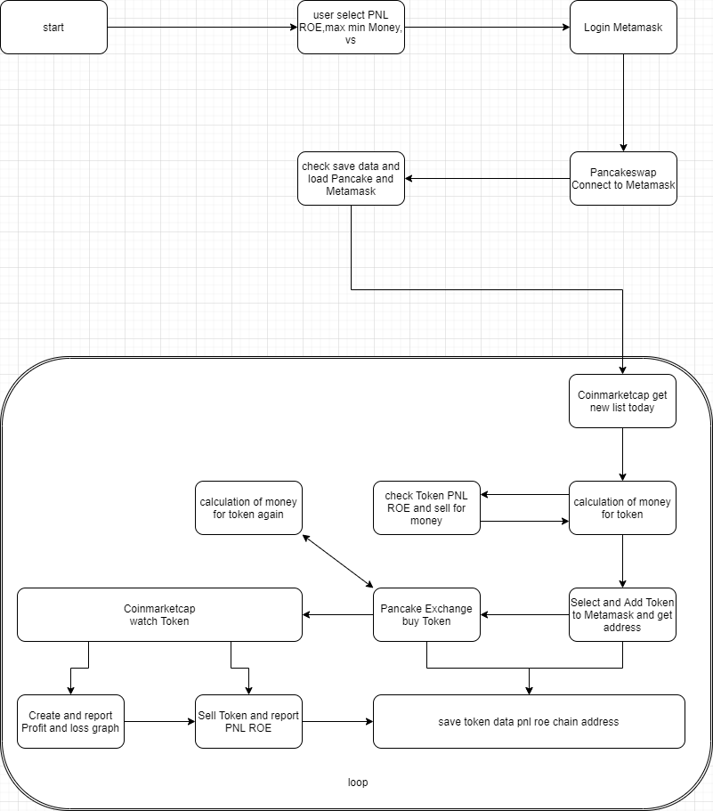
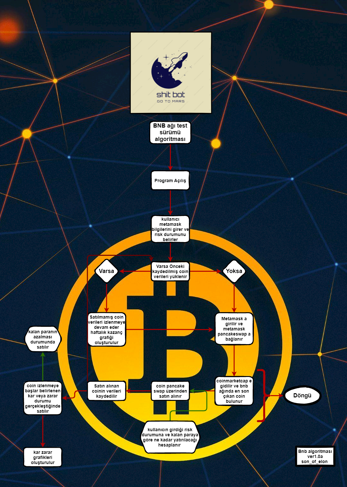
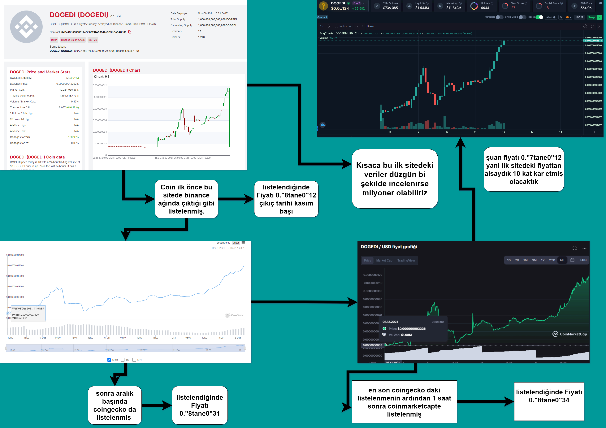
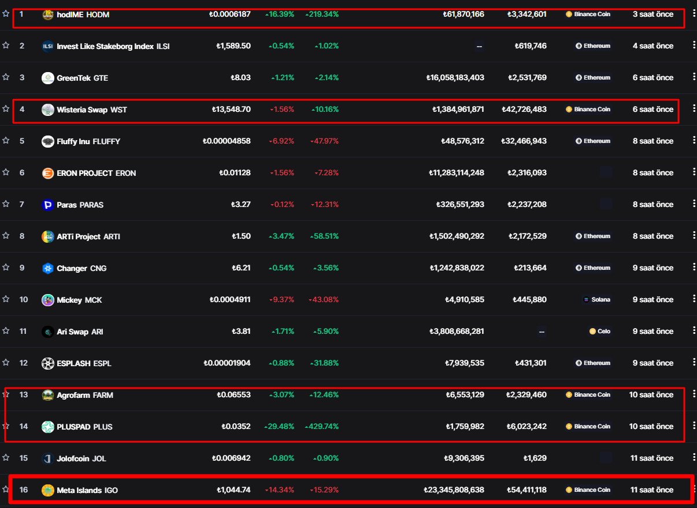

# Algorithm design

This document walks through the bot's original design, based on the
flowcharts and research notes from the project's planning phase, and maps
each step to what actually ended up in the code.

Two design passes exist:

- **v0** (August 2021) — the first pass at the flow, in English.
  
  Source: [algorithm-diagram.drawio](algorithm-diagram.drawio)

- **v1.0a** (December 2021) — a more detailed revision, including
  risk-based position sizing and a save/resume step.
  
  Source: [design-v1.0a.drawio](design-v1.0a.drawio), with an earlier
  working copy at [design-v1.0a-draft.drawio](design-v1.0a-draft.drawio).

## Designed flow (v1.0a)

1. **Startup** — the user enters their MetaMask credentials and sets a
   risk profile (target PNL / ROE, min/max amount to spend per coin).
2. **Resume check** — if data from a previous run exists, load it and keep
   monitoring any coins that were bought but not yet sold, plotting a
   weekly earnings graph. Otherwise, log into MetaMask and connect it to
   PancakeSwap.
3. **Find new listings** — go to CoinMarketCap and find the newest coin
   listed on the BNB (Binance Smart Chain) network.
4. **Size the position** — based on the user's risk profile and remaining
   balance, calculate how much to spend on this coin.
5. **Buy** — buy the coin through PancakeSwap.
6. **Record** — save the purchase (token, chain, address, amount) so it
   survives a restart.
7. **Monitor and sell** — keep watching the coin's price on CoinMarketCap;
   sell once it hits the configured profit or loss target, or if the
   remaining balance runs low. Log the result to a profit/loss graph.
8. Loop back to step 3 for the next newly listed coin.

## Why speed matters: the DOGEDI case study

While designing the bot, I tracked one coin (DOGEDI) across the sites
that pick it up over time: a raw BSC contract explorer first, then
CoinGecko, then CoinMarketCap roughly an hour later. The price at each
stage was already noticeably higher than at first detection — the whole
premise of the bot is that watching the earliest possible source (rather
than CoinMarketCap, which lists things later) is where the edge is. This
is also why `bot/scraper.py` polls CoinMarketCap's own "new" page directly
instead of waiting for a coin to reach a slower-moving listings site.

## Filtering to the BNB chain

CoinMarketCap's "new" page lists coins across every chain. The screenshot
above is an early manual pass at the filter `bot/scraper.py` automates:
only rows on the BNB / Binance Coin network (highlighted) are kept, and
only if they were listed within the last few hours — see the `"hours" in
word and "BNB" in word` check in `GetCapNewListedToday.go2Cap`.

## What actually got implemented

The buy-side pipeline matches the design closely. The position-sizing,
sell, resume, and weekly-graph logic were designed but missing from the
code as of the last cleanup pass; they have since been filled in based on
a description of the original exit rule, in the same style as the rest of
the bot:

| Design step | Status | Where |
| --- | --- | --- |
| Log into MetaMask, connect to PancakeSwap | Implemented | `bot/metamask_wallet.py`, `bot/pancake_dex.py` |
| Scrape CoinMarketCap for new BNB chain listings | Implemented | `bot/scraper.py` |
| Buy the coin via PancakeSwap | Implemented | `bot/trader.py` (`Swap.pancake_ex`) |
| Record the purchase | Implemented | `data/bought/`, `bot/storage.py` |
| User-set risk profile (min/max money per coin) | Implemented | `bot/risk_config.py`, read from `.env`, re-read every loop so it's editable without restarting |
| Split remaining BNB across queued coins, clamped to the risk profile | Implemented | `bot/trader.py` (`Swap.size_and_enter_position`) |
| Resume monitoring of previously bought, unsold coins on startup | Implemented | `bot/positions.py` — state already lives in `data/bought/positions.csv` / `data/sold/sold.csv`, so resuming is just reading those files again |
| Auto-sell on profit/loss target | Implemented | `bot/seller.py` (`Seller`) — see the exit rule below |
| Weekly profit/loss graph | Implemented | `bot/pnl_graph.py`, reads `data/sold/sold.csv` |

### The exit rule

The rule, as designed: most coins that don't pop early just trend to
zero, so cut losses on those; but a coin that does pop can keep running
far past the point you'd normally take profit, so the goal is to ride it
as long as it keeps making new highs and only get out once it's clearly
turned.

- **First 24 hours:** if the price never reaches +30% above the buy
  price in that window, sell — this coin isn't going to be one of the
  ones that runs.
- **After +30% is reached:** keep holding through normal up-and-down
  noise (a coin bouncing 90% → 70% → 80% → 100% is still fine). Only
  sell once the price has dropped for a few checks in a row from its
  peak — a confirmed reversal (e.g. peaking at +170%, then 160 → 150 →
  140 → falling) — to lock in gains before the usual post-pump crash.

Implemented in `bot/seller.py` as `STOP_LOSS_WINDOW_HOURS` /
`STOP_LOSS_THRESHOLD_PCT` (the 24h / 30% rule) and
`CONSECUTIVE_DROPS_TO_SELL` (how many checks in a row have to drop before
it counts as a reversal). The gain/peak tracking and the reversal check
are plain Python and were verified against both examples above; the
PancakeSwap steps used to actually execute a sell were never run against
the live site, unlike the buy flow, which at least worked at some point
in 2022 (see the historical CSVs in `data/`) — treat the sell-side
Selenium code as a rougher draft than the rest of the bot.

In short: the bot now buys, sizes the position, tracks it, and knows
when it should sell — the part most likely to need fixing before it
would actually work end to end is the handful of PancakeSwap selectors
in `bot/seller.py`'s `_sell` method.
